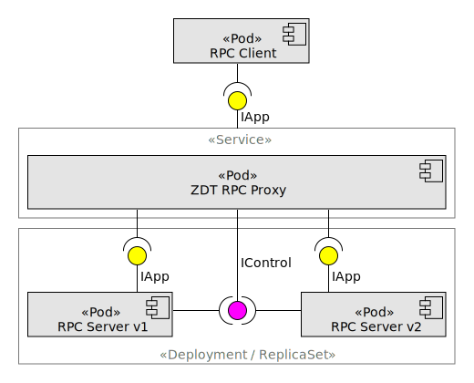

Purpose of this document is to store ideas and thoughts about some technical decisions.

# Adding timeout and cancellation possibilities for RPC

## Requirements

* Timeout and cancellation must be able to be specified for each method separately.
* There is no default timeout value. Calls aren't time limited unless a timeout is specified.
* Timeout is a time span within which a call should be completed.
* If the zero timout value is used then the call immediately times out.
* The timeout is sent with a call to the service and is independently tracked by both the client and the service. It is possible that a call completes on one machine, but by the time the response has returned to the client the call has been timed out.
* Behaviour of the client and the service when a call is timed out:
    * The client should immediately abort the underlying call and throw an error.
    * On the server, the executing call should be aborted but the service method should continue to run until it completes. So, letting the method know that the call is aborting allows the method to be cancelled along with the call.
* Timeout and cancellation propagation will be implemented in future.

## Solution

RPC is asynchronous by nature. Among other things it implies having possibility to get a call's reply asynchonously, to cancel a call, to set a call's timeout and to set a call's metadata. In Scabra RPC contracts are specified with .NET interfaces. For getting a reply asynchronously .NET provides - ```Task```, for cancellation - ```CancallationToken```. Requiring for each .NET interface method to have amoung its parameters ```CancellationToken```, timeout, metadata and returning a ```Task``` is convinient for Scabra, but is not convinient and flexible for the users (developers), because, firstly, there may be needs to remotely call a method synchonosly without ability to cancell it or to be timed out and, secondly, there must be some strict rules of method signatures. gRPC solves it by defining contracs with ```protobuf``` where developers define pure functionality without asynchronous infrastructure overhead. Having such ```protobuf``` contracts gRPC generates .NET methods with all required async features. It is convinient. We will do the same.

## Design

Scabra will be able to accept a contract as a .NET interface without cancellation token, timeout parameters and even without ```Task``` return value. If a method is asynronous the return type will be ```Task``` of course, but if a method is synchronous it will be not required for the method to have ```Task``` return type. To inject additional parameters and change return type to ```Task``` new interfaces and base classes will be generated for both the client and the server based on _the contract .NET interface_ provided by the developer. Let it be named as ```IService```.

  ```
  interface IService 
  { 
    void Method1(int p); 
    byte Method2(int[] a); 
  } 
  ```

### Client

Scabra will provide the extension method of _the contract .NET interface_, named ```Upgrade```. It will return the new generated .NET interface ```IService_Upgraded``` inhereted from _the contract .NET interface_. The new interface duplicates each of the original methods and adds the new parameter of ```CallOptions``` type to its parameter list. ```CallOptions``` contains ```Timeout``` and ```CancellationToken``` properties which are used for passing timeout value and cancellation request. By default ```Timeout``` property has ```Timeout.InfiniteTimeSpan``` value which means a call is not time limited. By default ```CancellationToken``` property has ```CancellationToken.None``` value which means a call can not be cancelled. The client proxy declares the new methods as abstract ones. Each of the original interface methods of the proxy invokes the corresponding new method with the default values of ```CallOptions``` properties. Additionally Scabra will change the return type of each new methods to ```Task``` if the original type is ```void``` or to ```Task<T>``` if the original type is ```T```. If the original type is ```Task``` then the return type is left the same. Handling the return types of original interface methods is obvious.

  ```
  intercase IService_Upgraded : IService
  { 
    Task Method1(int p, CallOptions options); 
    Task<byte> Method2(int[] a, CallOptions options); 
  }

  static class IServiceExtension 
  {
    static IService_Upgraded Upgrade(static IService service)
    {
        return (IService_Upgraded) service;
    }
  }

  [RpcClientProxy]
  internal partial class ServiceScabraProxy : IService_Upgraded
  {
    public void Method1(int p) { Method1(p, CallOptions.Null).Result; }
    public byte Method2(int[] a) { return Method2(a, CallOptions.Null).Result; }

    public Task Method1(int p, CallOptions options) { ... }
    public Task<byte> Method2(int[] a, CallOptions options) { ... }
  }
 
  IService service = ...;
  await service.Upgrade().Method1(p, new CallOptions { Timeout = 25, CancellationToken = ... });
  ```

### Server

Scabra will generate the base class for the service inherited from _the contract .NET interface_. The base class name will be ```BaseService```. It will duplicates each of the original methods and adds the new parameter of ```ServerCallContext``` type to its parameter list. ```ServerCallContext``` contains ```Timeout``` and ```CancellationToken``` properties with values specified in the client. Scabra will call those duplicates. Implementation of the original methods will throw ```NotSupportedException```. The return types of the original methods will not be changed.

  ```
  [RpcService]
  internal partial class BaseService : IService
  {
    public void Method1(int p) { throw new NotSupportedException(); }
    public byte Method2(int[] a) { throw new NotSupportedException(); }

    public void Method1(int p, ServerCallContext context) { ... } // abstract
    public byte Method2(int[] a, ServerCallContext context) { ... } // abstract
  }
  ```

### TODO: Some thoughts from Internet

* NO default timeout, cancellation (like in gRPC)
  * https://learn.microsoft.com/en-us/aspnet/core/grpc/deadlines-cancellation?view=aspnetcore-9.0
* EnableCallContextPropagation (cool feature)
* Some more info (don't remember why it is saved)
  * https://learn.microsoft.com/en-us/aspnet/core/tutorials/grpc/grpc-start?view=aspnetcore-9.0&tabs=visual-studio
  * https://learn.microsoft.com/en-us/aspnet/core/grpc/deadlines-cancellation?view=aspnetcore-9.0
  * https://github.com/grpc/grpc-dotnet/blob/master/src/Grpc.Core.Api/AsyncUnaryCall.cs

# Kubernetes support

## RPC zero-downtime on rolling update

### If an application is horizontally scalable

* **Readiness probes** are necessary for hanlding client requests during the pod startup process.
* **Liveness probes** are necessary for letting k8s know if an application is alive or not in case of the app's container is still running.
* There is always a possibility that some client requests may not be processed because of the race condition between the ```SIGTERM``` signal and removing the pod's entries from the ```iptable``` of nodes during the pod shutdown process. It leads to necessity of having some **retry policy at the client side of RPC**.
* The following **strategy of the server shutdown process** is selected to increase possiblity of handling client requests:
  1. Handle ```SIGTERM``` signal.
  1. Accept all client requests during the configurable period. *This period gives k8s possibility to clean up ```iptables``` of nodes after which all requests are sent to other nodes.* Let the period default value be 5 seconds.
  1. Do not accept any new requests and process all current requests.
  1. Exit the process.
    
  The initial period of accepting request can be eliminated and moved to the container pre-stop hook (sleep in shell script). This option is not selected because it requires the developer to be aware of this.

### If an application is NOT horizontally scalable

* Such applications must meet all of the above requirements.
* For clarify and readability, in this section ```ZDT RPC Proxy``` will be refered as ```Proxy```, ```RPC Client``` as ```Client```, ```RPC Server``` as ```Server```.

#### ZDT Kubernetes rolling update process

_```Proxy``` effectively transforms a not zero downtimable application into a zero downtimable one._



_Preconditions_

* ```Client``` sends calls to ```Proxy``` that redirects them to ```Server v1``` that acceptes and processes the calls. ```RPC Server v1``` is the only pod before the rolling update process.
* ```Server Deployment``` has ```maxUnavailable = 0``` and ```maxSurge = 1```.
* No ```pre-stop``` hook is configured for ```Server``` pod.
* _Termination Grace Period_ of ```Server``` application is less than ```terminationGracePeriodSeconds``` of ```Server``` pod.

_Trigger_

* ```Server Deployment``` pod template is updated with version 2 of ```Server```.

_Minimal Guarantee_

* All calls are processed by either ```Server v1``` or ```Server v2``` during the rolling update process.

_Success Guarantee_

* After ```Server v2``` pod has started processing calls, no call is processed by ```Server v1``` pod.

_Main Success Scenario_

* 1\. k8s starts up ```Server v2```.

_Steps 2, 9, 12 start at the same time._

_```Server v1``` side_

* 2\. ```Server v1``` receives the ```SIGTERM``` from k8s and starts _Termination Grace Period_.
* 3\. ```Server v1``` waits for _Termination Grace Period_ to end.
  * 3a. ```Proxy``` sends a call to ```Server v1```.
    * 3a1. ```Server v1``` accepts the call for processing.
    * 3a2. Go to step 3.
* 4\. ```Server v1``` sends ```Proxy``` **```NAC``` notification**.
* 5\. ```Server v1``` completes processing all accepted calls.
  * 5a. ```Proxy``` sends a call to ```Server v1```.\
    _```Proxy``` must not send any call to ```Server v1``` after ```NAC``` notification._
    * 5a1. ```Server v1``` logs the error.
    * 5a2. Go to step 5.
* 6\. ```Server v1``` sends ```Proxy``` **```RFT``` notification**.
* 7\. ```Server v1``` terminates.

_```Server v2``` side_

* 8\. ```Server v2``` sends ```Proxy``` **```RFC``` notification**.
* 9\. ```Server v2``` waits and accepts a call for processing.
* 10\. Go to step 9.

_```Proxy``` side_

* 11\. ```Proxy``` waits a call from ```Client```.
  * 11a. ```Proxy``` **receives ```RFC from Server v2```**. The fact is marked as **```RFC-v2-true```**.
    * 11aa. **```NAC-v1-false```**
      * 11aa1. Go to step 11.
    * 11ab. **```NAC-v1-true``` and ```RFT-v1-false```**
      * 11ab1. Go to step 11.
    * 11ac. **```NAC-v1-true``` and ```RFT-v1-true```**
      * 11ac1. ```Proxy``` dequeues calls and sends them to ```Server v2```. 
      * 11ac2. Go to step 11.
  * 11b. ```Proxy``` **receives ```NAC from Server v1```**. The fact is marked as **```NAC-v1-true```**.\
    _Assert(RFT-v1-false)_
    * 11b1. Go to step 11.
  * 11c. ```Proxy``` **receives ```RFT from Server v1```**. The fact is marked as **```RFT-v1-true```**.\
    _Assert(NAC-v1-true)_
    * 11ca. **```RFC-v2-false```**
      * 11ca1. Go to step 11.
    * 11cb. **```RFC-v2-true```**
      * 11cb1. Go to step 11ac1.
  * 11d. ```Client``` sends a call and **```NAC-v1-false```**.
    * 11d1. ```Proxy``` accepts the call and sends it to ```Server v1```.
    * 11d2. Go to step 11.
  * 11e. ```Client``` sends a call and **```NAC-v1-true``` and ```RFT-v1-false```**.
    * 11e1. ```Proxy``` accepts the call and enqueues it.\
      _The call's processing may be timed out. So, the client must handle it and retry the call._ 
    * 11e2. Go to step 11.
  * 11f. ```Client``` sends a call and **```NAC-v1-true``` and ```RFT-v1-true``` and ```RFC-v2-false```**.
    * 11f1. Go to 11e1.
  * 11g. ```Client``` sends a call and **```NAC-v1-true``` and ```RFT-v1-true``` and ```RFC-v2-true```**.
    * 11g1. ```Proxy``` accepts the call and sends it to ```Server v2```.
    * 11g2. Go to end.

## Observer zero-downtime on rolling update